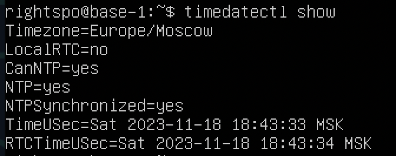
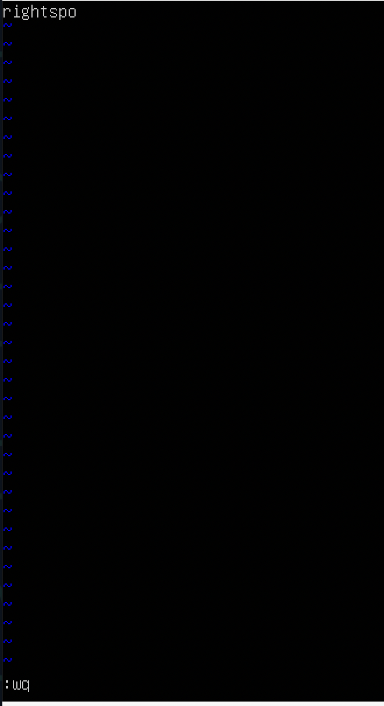

<h1>Linux_report</h1>

<h2>1.Installation of the OS</h2>

Ubuntu version

<h2>2.Creating a user</h2>

User created and added to adm 

Output of command cat "/etc/passwd"

<h2>3.Setting up the OS network</h2>

1)Change hostname to "user-1"

2)Change timezome to Moscow

3)list of network interfaces 

&emsp;Lo interface(loopback interface) is a special virtual network interface that your computer uses to communicate with itself. It is used mainly for diagnostic and troubleshooting, and to connect to servers running on the local machine.

4)local network adress

5)gateway_and_default_ip

5)gateway_and_default_ip

6)ip, gw and DNS changed. Packet loss result

<h2>4.OS Update</h2>

<h2>5.Using the sudo command</h2>

&emsp;Sudo is a command-line utility for Unix and Unix-based operating systems such as Linux and macOS. The utility provides an efficient way to temporarily grant users or user groups privileged access to system resources so that they can run commands that they cannot run under their regular accounts. Users can even be granted permissions to run commands under the root account -- the most powerful account on Unix-like systems. Sudo also logs all commands and arguments so that administrators can track the behavior of sudo users.

<h2>6.Installing and configuring the time service</h2>

<h2>7.Installing and using text editors</h2>

all redactors installation

&emsp;To exit vim with changes you have to write ":wq".

&emsp;To exit vim without changes you have to write ":q!".

&emsp;To search in vim you have to write "/{pattern}".

&emsp;To search in vim you have to write "%s/{pattern_to_replace}/{new_pattern}/%s".

---------------------------------------------------------------

&emsp;To exit nano with changes you have to use ctrl + 'X' and then write "Yes".

&emsp;To exit nano with changes you have to use ctrl + 'X' and then write "No".

&emsp;To search in vim you have to use ctrl + 'W', then write "/{pattern}".

&emsp;To search in vim you have to use ctrl + '\', then  "{pattern_to_replace}", and then "{new_pattern}".

---------------------------------------------------------------

&emsp;To exit mcedit with changes press F10, then choose 'Save'.

&emsp;To exit mcedit with changes press F10, then choose 'No'.

&emsp;To search in mcedit press F7 and write "{pattern}".

&emsp;To search in mcedit press F7, write "{pattern_to_replace}" and "{new_pattern}".

<h2>8.Installing and basic setup of the SSHD service</h2>

Netstat - Print network connections, routing tables, interface statistics, masquerade connections, and multicast memberships.

&emsp;-t flag shows active TCP-connections.

&emsp;-a flag shows both listening and non-listening sockets.

&emsp;-a flag shows numerical addresses.

<h2>9.Installing and using the top, htop utilities</h2>

TOP:

&emsp;- Uptime: 17:31:51 up 18 min

&emsp;- Number of authorised users: 1

&emsp;- Total system load: 0.03, 0.03, 0.03

&emsp;- Total number of processes: 100

&emsp;- Cpu load: 0.0%

&emsp;- Memory load: 201.4

&emsp;- Pid of the process with the highest memory usage: 2667

&emsp;- Pid of the process taking the most CPU time: 2639

Top sorted by %CPU

Top sorted by TIME+

Htop sorted by PID

Htop sorted by %CPU

Htop sorted by %MEM

Htop sorted by TIME+<E+

Htop filtered by sshd<E+

Htop serch by syslog

Htop with hostname, clock and uptime output added

<h2>10.Using the fdisk utility</h2>

Info about discs

Swap size

Disc info:<\div>

&emsp;Disc name: /dev/sda

&emsp;Disc capacity: 10 G

&emsp;Number of sectors: 20971520

&emsp;Swap size: 1.4 G

<h2>11.Using the df utility</h2>

Df command

Df info:<\div>

&emsp;Partion size: 8408452 Kb

&emsp;Used: 4200496 Kb

&emsp;Available: 3759240 Kb

&emsp;Percentage used: 53%

Df -Th command

Df -Th info:<\div>

&emsp;Partion size: 8.1 G

&emsp;Used: 4.1 G

&emsp;Available: 3.6 G

&emsp;Percentage used: 53%

<h2>12.Using the du utility</h2>

flag "-h" outputs the info in human-readable format

flag "-s" outputs only the size of main catalog

<h2>13.Using the du utility</h2>

<h2>14.Working with system logs</h2>

<h2>15.Using the CRON job scheduler</h2>

