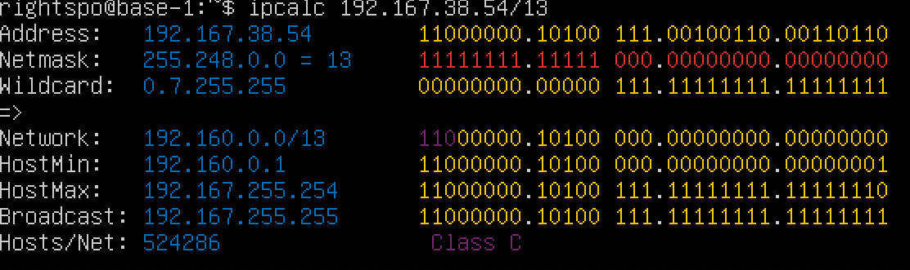
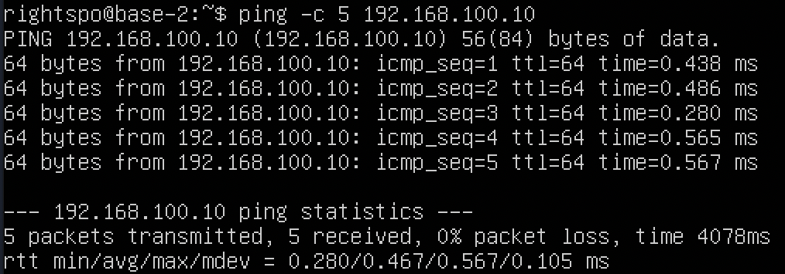
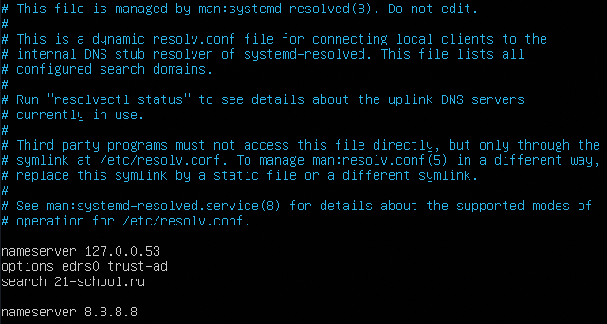
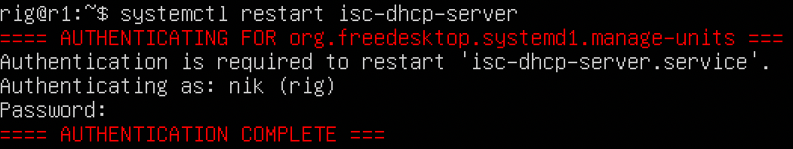
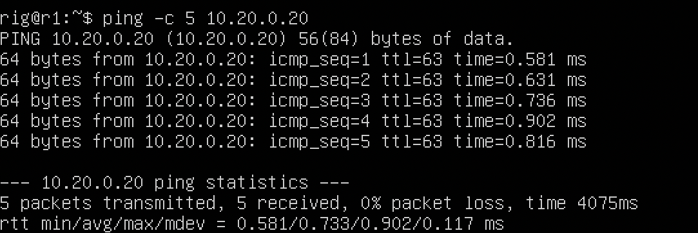
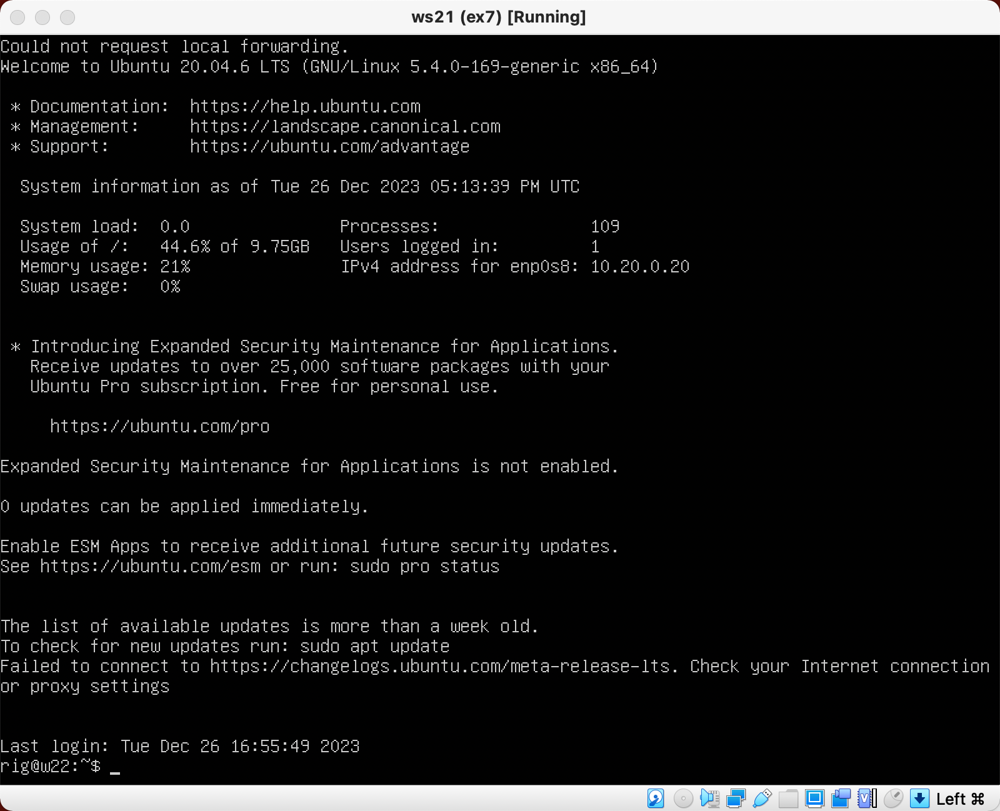

# D02_LinuxNetwork

## **Part 1. ipcalc tool**

### **1.1. Networks and Masks**

**1. Network address of 192.167.38.54/13**

\
*Интернет адрес 192.167.38.54/13*

Сетевым адресом для 192.167.38.54/13 является 192.160.0.0/13

**2. conversion of the mask 255.255.255.0 to prefix and binary, /15 to normal and binary, 11111111.11111111.11111111.11110000 to normal and prefix**

\
*Маска 255.255.255.0*

\
*Маска /15*

\
*Маска 11111111.11111111.11111111.11110000*

**3. minimum and maximum host in 12.167.38.4 network with masks: /8, 11111111.11111111.00000000.00000000, 255.255.254.0 and /4**

\
*Маска /8*

\
*Маска 11111111.11111111.00000000.00000000*

\
*Маска 255.255.254.0*

\
*Маска /4*

### **1.2. localhost**

Приложение, работающее на localhost, означает, что приложение запущено и функционирует на том же компьютере (или сервере), с которого производится запрос к нему.

Такое приложение использует сетевой адрес ***127.0.0.0/8***, который является специальным адресом для обратной связи на компьютере. Весь трафик, направленный на этот адрес, остается внутри компьютера и не покидает его сетевой интерфейс.

Для того, чтобы определить, можно ли обратиться к приложению, работающему на localhost, со следующими IP: *194.34.23.100*, *127.0.0.2*, *127.1.0.1*, *128.0.0.1,* пропингуем эти адреса:

\
*Пингуем ip из localhost*

### **1.3. Network ranges and segments**

  
Описание IP

  **Публичные IP(белые IP)** — адреса, которые используются для выхода в интернет и общения с другими устройствами, также обладающими публичными адресами.

  **Частные IP(серые IP)** — адреса, которые используются для связи устройств в локальных сетях. Такие устройства могут общаться между собой только при условии нахождния их в одном адресном пространстве.\
  Для частных IP-адресов выделены 4 подсети:\
  * 10.0.0.0 — 10.255.255.255 с маской 255.0.0.0;
  * 172.16.0.0 – 172.31.255.255 с маской 255.240.0.0;
  * 192.168.0.0 – 192.168.255.255 с маской 255.255.0.0;
  * 100.64.0.0 – 100.127.255.255 с маской 255.192.0.0 (используется в качестве адресов для CG-NAT).
  
  CG-NAT позволяет провайдерам выдавать разным устройствам один и тот же IP для выхода в интернет.

1) **Публичные IP(белые IP)**: 134.43.0.2, 172.0.2.1, 192.172.0.1, 172.68.0.2, 192.169.168.1.\
**Частные IP(серые IP)**: 10.0.0.45, 192.168.4.2, 172.20.250.4, 172.16.255.255, 10.10.10.10.
2) В диапазон ip адресов 10.10.0.0/18 входят адреса: 10.10.0.2, 10.10.10.10, 10.10.1.255
\
*Диапазон ip для 10.10.0.0/18*

## **Part 2. Static routing between two machines**

Перед установкой виртуальных машин выбираем у ws1 и ws2 в настроках в пункте "Сеть" второй адаптер и делаем его активным. В списке доступных сетей выбираем "Внутренняя сеть" и её название, оно должно быть одинаковым на обеих машинах.

\
*Сетевые интерфейсы машины ws1*

\
*Сетевые интерфейсы машины ws2*

  
Описание интерфейсов

  **lo (сетевой интерфейс)** — виртуальный интерфейс, присутствующий по умолчанию в любом Linux. Он используется для отладки сетевых программ и запуска серверных приложений на локальной машине. С этим интерфейсом всегда связан адрес 127.0.0.1. У него есть dns-имя – localhost. Посмотреть привязку можно в файле /etc/host.

  **enp0s3** — интерфейс "Nat" нашей виртуальной машины. Он позволяет общаться с интернетом.

  **enp0s8** — интерфейс локальной сети с названием "itnet". 

\
*Изменённый файл конфигурации ip на первой машине*

\
*Изменённый файл конфигурации ip на второй машине*

\
*Вывод команды `ip a` после применённх изменений на первой машине*

\
*Вывод команды `ip a` после применённх изменений на второй машине*

### **2.1. Adding a static route manually**

\
*Добавление нового статического маршрута на машине 1 командой `ip r add`*

\
*Добавление нового статического маршрута на машине 2 командой `ip r add`*

\
*Пинг второй машины*

\
*Пинг первой машины*

### **2.2. Adding a static route with saving**

\
*Статический маршрут на первой машине*

\
*Статический маршрут на второй машине*

\
*Пинг второй машины*

\
*Пинг первой машины*

## **Part 3. iperf3 utility**

### **3.1. Connection speed**

* 8 Mbps = 1 MB/s;
* 100 MB/s = 100000 Kbps
* 1 Gbps = 1000 Mbps

### **3.2. iperf3 utility**

Для определения скорости передачи пакетов необходимо сделать машину, принимающую пакеты, сервером. Для этого запустим на ней команду `iperf3 -s`.

\
*Использование команды `iperf3 -s`*

\
*Пингуем первую машину*

\
*Измеренная скорость на первой машине*

## **Part 4. Network firewall**

### **4.1. iptables utility**

\
*Furiwall первой машины*

\
*Furiwall второй машины*

\
*Запускаем firewall*

Разница между правилами заключается в том, что в firewall для первой машины мы прописали, что пришедший пакет следует заблокировать, а для второй принять. Потому первую машину попинговать невозмодно, в отличие от второй. Это связано с тем, что приоритет имеет правило идущее первым в файле `firewall.sh`.

### **4.2. nmap utility**

\
*Использование `ping` и `nmap` для определения неработающей машины*

\
*Сохранени dump'ов*

## **Part 5. Static network routing**

### **5.1. Configuration of machine addresses**

\
*Изменённый файл конфигурации ip на ws11*

\
*Изменённый файл конфигурации ip на ws21*

\
*Изменённый файл конфигурации ip на ws22*

\
*Изменённый файл конфигурации ip на r1*

\
*Изменённый файл конфигурации ip на r2*

\
*Вывод команды `ip -4 a` на ws11*

\
*Вывод команды `ip -4 a` на ws21*

\
*Вывод команды `ip -4 a` на ws22*

\
*Вывод команды `ip -4 a` на r1*

\
*Вывод команды `ip -4 a` на r2*

\
*Пинг r1 из ws11*

\
*Пинг ws22 из ws21*

### **5.2. Enabling IP forwarding.**

\
*Вызов команды `sysctl -w net.ipv4.ip_forward=1` на r1*

\
*Вызов команды `sysctl -w net.ipv4.ip_forward=1` на r2*

\
*Включение постоянной адресации на r1*

\
*Включение постоянной адресации на r2*

### **5.3. Default route configuration**

\
*Шлюз по умолчанию на ws11*

\
*Шлюз по умолчанию на ws21*

\
*Шлюз по умолчанию на ws22*

\
*Вывод команды `ip r` на ws11*

\
*Вывод команды `ip r` на ws21*

\
*Вывод команды `ip r` на ws22*

\
*Вывод команды `tcpdump -tn -i enp0s9` на r2*

### **5.4. Adding static routes**

\
*Изменённый файл конфигурации ip на r1*

\
*Изменённый файл конфигурации ip на r2*

\
*Вывод команды `ip r` на r2*

\
*Вывод команды `ip r` на r1*

\
*Вывод команд `ip r list 10.10.0.0/18` и `ip r list 0.0.0.0/0` на ws11*

Вызов команды `ip r list 10.10.0.0/18` выведет информацию о маршруте, связанном с конкретной подсетью.

Вызов команды `ip r list 0.0.0.0/0` используется для вывода информации о маршруте по умолчанию. Подсеть `0.0.0.0/0` представляет собой маршрут по умолчанию, который охватывает все возможные IP-адреса. Он указывает, как отправлять сетевой трафик, который не имеет явно заданного маршрута, или для которого не существует более конкретных маршрутов.

Для адреса 10.10.0.0/18 был выбран маршрут, отличный от 0.0.0.0/0, так как машина ws11 соединена с сетью 10.10.0.0/18 по своему IP-адресу 10.10.0.2, для других адресов используется маршрут по умолчанию, который указан в файле - 10.10.0.1.

### **5.5. Making a router list**

\
*Вывод команды `tcpdump -tnv -i enp0s8` на r1*

\
*Вывод команды `traceroute 10.20.0.10` на ws11*

Принцип работы утилиты `traceroute` основан на отправке сетевых **пакетов с TTL** и анализе ответов от промежуточных узлов сети. 
**Пакет данных с TTL**  означает сетевой пакет, в котором задано значение TTL, которое определяет количество промежуточных узлов, через которые пакет может проходить, прежде чем быть отброшенным. TTL является частью заголовка IP-пакета и используется для предотвращения зацикливания или бесконечного циркулирования пакетов в сети.
Вот как происходит построение пути при помощи `traceroute`:

1. Когда запускается `traceroute` к какому-либо адресу (IP-адресу или доменному имени), он начинает отправлять пакеты данных с TTL (Time To Live), установленным на 1, к указанному адресу. 
2. Первый узел (роутер) в сети, через который проходит пакет, уменьшает значение TTL на 1. Если после уменьшения значение TTL становится равным 0, узел отбрасывает пакет и отправляет обратно сообщение "Time Exceeded" обратно отправителю.
3. Отправитель `traceroute` записывает информацию о первом узле, через который прошел пакет, а затем увеличивает значение TTL на 1 и отправляет следующий пакет.
4. Процесс повторяется: каждый промежуточный узел уменьшает TTL, и если TTL достигает 0, он отправляет обратно сообщение "Time Exceeded". Отправитель записывает информацию об этом узле и переходит к следующему шагу.
5. Когда пакет наконец достигает финального пункта назначения (конечного IP-адреса), пункт назначения отправляет ответ "ICMP Echo Reply" (если протокол ICMP используется для пакетов), который достигает отправителя `traceroute`.
6. `traceroute` завершает свою работу, предоставляя список всех узлов (роутеров), через которые проходили пакеты, и информацию о времени, которое требовалось для прохождения каждого узла.

Таким образом, `traceroute` позволяет отследить маршрут, который пакеты данных проходят от отправителя к получателю через сеть, а также измерить задержки (пинг) на каждом промежуточном узле.

### **5.6. Using ICMP protocol in routing**

\
*Вывод команды `tcpdump -n -i enp0s8` на r1*

\
*Вывод команды `ping -c 1 10.30.0.111` на ws11*

\
*Сохранени dump'ов*

## **Part 6. Dynamic IP configuration using DHCP**

\
*Изменённый файл конфигурации DHCP на r2*

\
*Изменённый файл конфигурации resolv на r2*

\
*Вывод команды `systemctl restart isc-dhcp-server` на r2*

\
*Новый ip на ws21*

\
*Пинг ws22 из ws21*

Повторим ввод аналогичных команд для r1, добавив выдачу ip адреса ws11 по mac адресу. Для того, чтобы выдача по mac-адресу работала, необходимо предварительно его задать:

\
*Смена mac-адреса в настройках VB*

\
*Изменённый файл конфигурации на ws11*

\
*Изменённый файл конфигурации dhcpd.conf на r1*

\
*Изменённый файл конфигурации resolv.conf на r1*

\
*Вывод команды `systemctl restart isc-dhcp-server` на r1*

\
*Получение нового ip на ws11*

\
*Получение нового ip на ws21 от DCHP*

Для настройки DHCP использовался конфигурационный файл `/etc/dhcp/dhcpd.conf`.
Сервис *systemctl* для перезапуска и просмотра статуса службы DHCP
Конфигурационный файл `/etc/resolve.conf` для настройки DNS.

\
*Сохранени dump'ов*

## **Part 7. NAT**

\
*Изменённый файл конфигурации ports.conf на r1*

\
*Изменённый файл конфигурации ports.conf на ws22*

\
*Вывод команды `service apache2 start` на r1*

\
*Вывод команды `service apache2 start` на ws22*

\
*Изменённый файл firewall.sh на r2*

\
*Запустим файл firewall.sh на r2*

\
*Пинг ws22 из r1*

\
*Изменённый файл firewall.sh на r2 с icmp*

\
*Запустим файл firewall.sh на r2*

\
*Пинг ws22 из r1 с icmp*

\
*Включение SNAT и DNAT*

\
*Вызов команды `telnet 10.10.0.1 80` на ws22*

\
*Сохранени dump'ов*

## **Part 8. Bonus. Introduction to SSH Tunnels**

\
*Изменённый файл конфигурации ports.conf на ws22*

Подключаемся к виртуальной машине ws22 с помощью команды\
`ssh -R 9999:localhost:80 rig@10.20.0.20`

\
*Подключение к web серверу ws22 через ws21*

Подключаемся к виртуальной машине ws22 с помощью команды\
`ssh -R 9999:localhost:80 rig@10.20.0.20`

\
*Подключение к web серверу ws22 через ws11*

Проверяем доступность порта локального ip: 

\
*Вызов команды `telnet 10.10.0.1 333` на ws22*

\
*Сохранени dump'ов*